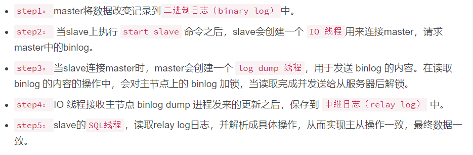

# Canal

## MySQL Binlog

**Binlog格式有三种：**  

1）statement：  
语句级，binlog 会记录每次一执行写操作的语句。相对 row 模式节省空间，但是可能产生不一致性，比如now()函数，
如果用 binlog 日志进行恢复，可能产生不同的数据。  
优点：节省空间。  
缺点：有可能造成数据不一致。  

2）row：  
行级， binlog 会记录每次操作后每行记录的变化。  
优点：保持数据的绝对一致性。不管 sql 是什么，引用了什么函数，他只记录执行后的效果。  
缺点：占用较大空间。  

3）mixed：  
statement 的升级版，一定程度上解决了，因为一些情况而造成的 statement 模式不一致问题，默认还是 statement，在某些情况下譬如：
当函数中包含 UUID() 时；包含
AUTO_INCREMENT 字段的表被更新时；执行 INSERT DELAYED 语句时；用 UDF 时；会按照 ROW 的方式进行处理  
优点：节省空间，同时兼顾了一定的一致性。  
缺点：还有些极个别情况依旧会造成不一致，另外 statement 和 mixed 对binlog 的监控的情况都不方便。  

**综合上面对比，Canal 想做监控分析，选择 row 格式比较合适。**  

## Mysql主从复制工作原理




## Canal 的工作原理
  
很简单，就是把自己伪装成 Slave，假装从 Master 复制数据。  

## 应用场景

### 场景1：更新缓存


### 场景 2：
  
抓取业务表的新增变化数据，用于制作实时统计（我们就是这种场景）

## TCP模式


```java
public class CanalClient {

    public static void main(String[] args) throws InterruptedException, InvalidProtocolBufferException {
        CanalConnector canalConnector = CanalConnectors.newSingleConnector(
            new InetSocketAddress("hadoop102", 11111), "example", "", "");

        while (true) {

            //TODO 连接
            canalConnector.connect();

            //TODO 订阅数据库
            canalConnector.subscribe("gmall-2021.*");

            //TODO 获取数据
            Message message = canalConnector.get(100);

            //TODO 获取Entry集合
            List<CanalEntry.Entry> entries = message.getEntries();

            if (entries.size() <= 0) {
                System.out.println("当次抓取没有数据，休息一会。。。。。。");
                Thread.sleep(1000);
            } else {

                //TODO 遍历entries，单条解析
                for (CanalEntry.Entry entry : entries) {

                    //1.获取表名
                    String tableName = entry.getHeader().getTableName();

                    //2.获取类型
                    CanalEntry.EntryType entryType = entry.getEntryType();

                    //3.获取序列化后的数据
                    ByteString storeValue = entry.getStoreValue();

                    //4.判断当前entryType类型是否为ROWDATA
                    if (CanalEntry.EntryType.ROWDATA.equals(entryType)) {

                        //5.反序列化数据
                        CanalEntry.RowChange rowChange = CanalEntry.RowChange.parseFrom(storeValue);

                        //6.获取当前事件的操作类型
                        CanalEntry.EventType eventType = rowChange.getEventType();

                        //7.获取数据集
                        List<CanalEntry.RowData> rowDataList = rowChange.getRowDatasList();

                        //8.遍历rowDataList，并打印数据集
                        for (CanalEntry.RowData rowData : rowDataList) {

                            JSONObject beforeData = new JSONObject();
                            List<CanalEntry.Column> beforeColumnsList = rowData.getBeforeColumnsList();
                            for (CanalEntry.Column column : beforeColumnsList) {
                                beforeData.put(column.getName(), column.getValue());
                            }

                            JSONObject afterData = new JSONObject();
                            List<CanalEntry.Column> afterColumnsList = rowData.getAfterColumnsList();
                            for (CanalEntry.Column column : afterColumnsList) {
                                afterData.put(column.getName(), column.getValue());
                            }

                            //数据打印
                            System.out.println("Table:" + tableName +
                                    ",EventType:" + eventType +
                                    ",Before:" + beforeData +
                                    ",After:" + afterData);
                        }
                    } else {
                        System.out.println("当前操作类型为：" + entryType);
                    }
                }
            }
        }
    }
}
```

## Kafka模式
